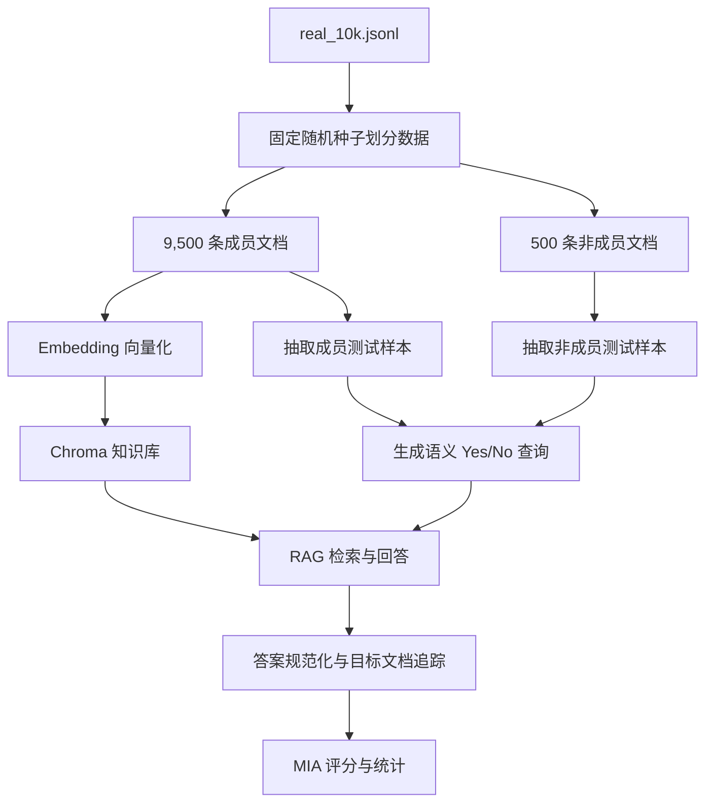

# RAG Stealthy Membership Inference

面向检索增强生成（RAG）系统的**黑盒成员推断**实验：判断一篇候选文档是否被收录在目标 RAG 知识库中。

思路参考论文 **Riddle Me This! Stealthy Membership Inference for Retrieval-Augmented Generation**：攻击者围绕候选文档构造若干自然、泛化的 Yes/No 语义问题，再观察 RAG 的回答——若系统能持续准确回答，则该文档更可能是知识库成员；若大量回答 `Unknown`，则更可能是非成员。

> 本项目仅用于授权环境中的 AI 安全研究、隐私风险评估与防御验证。

## 1. 核心思想

攻击者不读取向量库或任何内部参数，只调用问答接口。判定的本质区别在于：

| | 成员文档 | 非成员文档 |
| --- | --- | --- |
| 是否在知识库中 | 是 | 否 |
| 语义改写后能否被检索到 | 大概率能 | 不能 |
| RAG 回答倾向 | 准确回答 Yes/No | 多为 Unknown |
| 成员得分 | 偏高（接近 +1） | 偏低（接近 -λ） |

核心手段是**语义探测（Semantic Probe）**：不直接问「这篇文档在库里吗」，而是把文档内容改写为多个原子事实的 Yes/No 问题，用「回答正确率」间接推断成员身份。

## 2. 整体流程



各步骤对应的代码模块：`data.py`（B）、`embeddings.py` + `vectorstore.py`（E/F）、`query_generation.py`（I）、`rag.py`（J/K）、`scoring.py` + `evaluation.py`（L），详见 §5。

## 3. 威胁模型

攻击者假设：

- 可访问目标 RAG 的问答接口；
- 持有一篇待判断的候选文档；
- 无法读取向量数据库、Embedding 向量或系统内部参数；
- 可围绕候选文档生成若干自然问题并重复查询；
- 依据系统回答推断该文档是否在知识库中。

> 代码额外记录了目标文档是否被检索、排名与距离，仅用于实验诊断（区分「检索失败」与「生成失败」），不属于严格黑盒攻击必须具备的信息。最终成员判断只依赖 `predicted_answer`。

## 4. 方法

### 4.1 数据划分

- 读取 `real_10k.jsonl`（约 1 万条英文漏洞描述）；
- 固定种子 `seed=42` 均匀随机抽取 9,500 条作为知识库成员，剩余 500 条作为非成员候选；
- 用原始行号 `source_line_xxx` 标识文档，便于验证检索结果；
- 划分结果持久化到 `real_9500_members.jsonl`、`real_500_nonmembers.jsonl` 与 `real_10k_split.json`，确保换模型重跑仍用完全相同的数据划分。

### 4.2 Embedding 与向量库

英文漏洞语料默认推荐：

```python
EMBEDDING_MODEL = "BAAI/bge-base-en-v1.5"   # 768 维
```

创建 Embedding 模型：

```python
import torch
from langchain_huggingface import HuggingFaceEmbeddings


def create_embedding_model():
    if not torch.cuda.is_available():
        raise RuntimeError("CUDA 不可用，请检查 PyTorch CUDA 版本和显卡驱动")

    return HuggingFaceEmbeddings(
        model_name="BAAI/bge-base-en-v1.5",
        model_kwargs={"device": "cuda"},
        encode_kwargs={"normalize_embeddings": True, "batch_size": 64},
        show_progress=True,   # 不要放进 encode_kwargs，否则会重复传参
    )
```

注意事项：

- `show_progress_bar` 不要放入 `encode_kwargs`，否则报 `SentenceTransformer.encode() got multiple values for keyword argument 'show_progress_bar'`；
- 换 Embedding 模型后必须换新持久化目录并重建，不能混用旧向量。

> ⚠️ 当前向量库为 `chroma_bge_base_en_v15_9500/`（集合 `real_9500_bge_base_en`），用 `BAAI/bge-base-en-v1.5`（768 维）构建。更换 Embedding 模型后必须重建并换新目录，不能把不同维度向量混在同一集合。

### 4.3 大语言模型

通过 OpenAI 兼容接口调用 `qwen3-4b`（本地部署；也可换成任意兼容模型），关闭思考模式以降低输出波动：

```python
import os
from dotenv import load_dotenv
from langchain.chat_models import init_chat_model

load_dotenv()

chat_model = init_chat_model(
    model="qwen3-4b",
    model_provider="openai",
    api_key=os.getenv("api_key"),
    base_url=os.getenv("base_url"),
    temperature=0,
    extra_body={"chat_template_kwargs": {"enable_thinking": False}},
)
```

根目录 `.env`：

```dotenv
api_key=YOUR_API_KEY
base_url=YOUR_OPENAI_COMPATIBLE_BASE_URL
```

> `.env`、API Key 等凭据不得提交到公开仓库（已在 `.gitignore` 中忽略）。

### 4.4 语义查询生成

对每篇候选文档，先由 LLM 生成一段简短的「检索摘要」，再围绕原子事实构造多个 Yes/No 问题。完整查询示例：

```text
The document details multiple cross-site scripting vulnerabilities found in
version 1.2 of the Redoable theme, specifically involving the 's' parameter
in two PHP files.

Do the described XSS vulnerabilities affect Redoable version 1.2?

Please answer with Yes, No, or Unknown.
```

生成约束：

- 每个问题只检查一个原子事实；
- Yes 与 No 标准答案尽量平衡；
- 避免直接复制候选文档原句；
- 摘要不得直接泄漏问题答案；
- 避免模糊版本范围（如未定边界的 "or later"）；
- 问题要自然，不得显式询问「该文档是否在知识库中」。

`src/query_generation.py` 内置轻量质量检查（版本歧义、过短/过长、摘要重叠）。

### 4.5 RAG 回答与答案判定

回答约束为三类：`yes` / `no` / `unknown`（`Unknown` 涵盖「不知道」「上下文不足以判断」等）。

判定策略：优先加强结构化输出约束；解析失败时用独立语义裁判归一化。**不要**用简单包含判断（如 `"no" in response`），以免误匹配 `not`、`unknown` 或解释文本。

每个问题记录：

- `predicted_answer` / `answer_matches`：回答与是否答对（黑盒信号）；
- `target_retrieved` / `target_rank` / `target_distance`：目标文档是否命中及排名/距离（诊断信号）；
- `top1_distance` / `top1_source_line`：Top-1 文档信息；
- `retrieved_documents`：本次检索到的文档及元数据。

### 4.6 成员得分

对第 i 个查询定义信号分数：

```text
s_i = +1      RAG 回答正确
      -λ      RAG 回答 Unknown   （λ = 0.5）
       0      RAG 给出错误的 Yes/No
```

一篇文档的成员得分为其所有问题信号分数的均值：

```text
S = (1/m) · Σ s_i     # m = 该文档的问题数量（初步实验用 3）
```

> 成员得分来自「RAG 回答 vs 预生成标准答案」的**确定性比较**，而非让 LLM 直接输出任意「成员概率」。LLM 只负责生成问题和必要时归一化答案。

### 4.7 评估指标

- 成员/非成员平均得分及分布；
- 文档级 ROC-AUC；
- 不同阈值下的准确率、精确率、召回率、假阳性率；
- 目标文档 Recall@k 及检索命中/未命中时的回答正确率；
- Yes/No/Unknown 分布；
- Bootstrap 置信区间与 Mann-Whitney U 检验。

## 5. 项目结构

```text
private_qwen/
├── README.md
├── .env                      # 密钥，不提交
├── .gitignore
├── requirements.txt
├── evaluate.py               # 离线评估入口（无需 GPU）
├── run_experiment.py         # 端到端实验入口（需 GPU）
├── real_10k.jsonl            # 原始语料
├── real_10k_split.json       # 数据划分清单
├── real_9500_members.jsonl   # 成员文档
├── real_500_nonmembers.jsonl # 非成员文档
├── member_semantic_test.{json,csv}
├── nonmember_semantic_test.{json,csv}
├── evaluation_report.json
├── chroma_bge_base_en_v15_9500/  # 向量库（bge-base-en, 768 维）
├── src/
│   ├── config.py             # 集中配置
│   ├── data.py               # 数据读取与划分
│   ├── embeddings.py         # Embedding 模型
│   ├── vectorstore.py        # Chroma 构建/加载
│   ├── llm.py                # LLM 构建与输出解析
│   ├── query_generation.py   # 探测生成 + 质量检查
│   ├── rag.py                # RAG 回答与归一化
│   ├── scoring.py            # 信号分数
│   ├── evaluation.py         # 离线评估
│   ├── pipeline.py           # 非 DP 端到端编排
│   ├── dp_rag.py             # DP-RAG 核心（voter+baseline+加噪）
│   ├── pipeline_dp.py        # DP 端到端编排
│   └── reranker.py           # Cross-Encoder 重排序
└── teach.ipynb               # 原始探索 Notebook
```

模块职责：

| 模块 | 职责 |
| --- | --- |
| `src/config.py` | 所有路径/模型/参数的单一来源（`Config` + `DEFAULT` / `LEGACY_BGE_SMALL_ZH` 预设） |
| `src/data.py` | 读取 jsonl、按种子划分、构建 Document |
| `src/embeddings.py` | 创建 GPU Embedding 模型 |
| `src/vectorstore.py` | 构建 / 加载 Chroma 向量库 |
| `src/llm.py` | 构建对话模型、解析 JSON 输出 |
| `src/query_generation.py` | 生成摘要 + Yes/No 探测问题 + 质量检查 |
| `src/rag.py` | 检索增强回答 + 答案归一化 |
| `src/scoring.py` | 信号分数（+1 / -λ / 0）与成员得分 |
| `src/evaluation.py` | 离线统计（AUC / 阈值 / Bootstrap / Mann-Whitney） |
| `src/pipeline.py` | 非 DP 端到端编排 |
| `src/dp_rag.py` | DP-RAG 核心：voter 集成 + baseline + 直方图加噪 + 预算 |
| `src/pipeline_dp.py` | DP 端到端编排 |
| `src/reranker.py` | Cross-Encoder 重排序（可选） |

## 6. 快速开始

> 本仓库不包含数据集、向量库与实验输出（均已在 `.gitignore` 中忽略），请先准备数据再运行。

### 6.0 准备数据

将 `real_10k.jsonl` 放在项目根目录（每行一个 JSON 对象，至少含 `text` 字段）。首次运行会按固定种子 `seed=42` 自动划分为 9500 条成员 + 500 条非成员，并构建向量库。

### 6.1 环境

```bash
conda create -n dp_rag_gpu python=3.11 -y
conda activate dp_rag_gpu
```

安装 CUDA 版 PyTorch（以 CUDA 12.8 为例，注意 `--index-url` 前是**两个**连字符）：

```bash
python -m pip install --upgrade pip
python -m pip install torch torchvision torchaudio --index-url https://download.pytorch.org/whl/cu128
```

安装项目依赖：

```bash
python -m pip install -r requirements.txt
```

验证 GPU：

```bash
python -c "import torch; print('cuda:', torch.cuda.is_available()); print('gpu:', torch.cuda.get_device_name(0) if torch.cuda.is_available() else 'N/A')"
```

预期 `cuda: True` 且 `gpu: NVIDIA ...`。若为 `False`，先检查环境、PyTorch Wheel 与驱动，不要在代码里强制 `device="cuda"`。

### 6.2 配置 `.env`

复制 `.env.example` 为 `.env` 并填入你的配置（`.env` 已被 `.gitignore` 忽略，不会提交）：

```dotenv
api_key=YOUR_API_KEY
base_url=YOUR_OPENAI_COMPATIBLE_BASE_URL
```

### 6.3 运行

```bash
# 1) 离线评估：对已保存结果做统计（无需 GPU / 模型 / .env）
python evaluate.py

# 2) 完整实验：重新生成探测、检索、回答与评分（需 GPU + .env）
python run_experiment.py            # 非 DP 基线
python run_experiment_dp.py         # DP 对比方案（voter 集成 + 加噪）
```

完整实验内部依次执行：划分数据 → 构建/加载向量库 → 抽样 → 生成探测 → RAG 回答 → 评分 → 评估，并输出 `member_semantic_test.*`、`nonmember_semantic_test.*` 与 `evaluation_report.json`。交互式探索可参考 `teach.ipynb`。

## 7. 实验结果

### 7.1 非 DP 基线（bge-base-en-v1.5，100 成员 + 100 非成员）

| 指标 | 成员 | 非成员 |
| --- | ---: | ---: |
| 平均 MIA 得分 | 0.9333 | -0.2100 |
| 回答正确率 | 95.33% | 17.33% |

| 指标 | 结果 |
| --- | ---: |
| 文档级 ROC-AUC | 0.9838 |
| Mann-Whitney U（双尾） | U=9838, p≈10⁻³⁶ |
| 目标文档检索率 | 98.0% |

### 7.2 DP 对比方案（qwen3-4b，50 成员 + 50 非成员）

| 指标 | 成员 | 非成员 |
| --- | ---: | ---: |
| 平均 MIA 得分 | 0.6133 | 0.4567 |
| 回答正确率 | 66.67% | 56.38% |

| 指标 | 结果 |
| --- | ---: |
| 文档级 ROC-AUC（答案信号） | 0.5936 |
| 文档级 ROC-AUC（私有使用率信号） | 0.6088 |
| Mann-Whitney p | 0.094 |
| 目标文档检索率 | 97.96% |

> 对比：DP 机制把 MIA 的 ROC-AUC 从 0.98 压到约 0.59，显著削弱了成员推断能力，量化了「隐私保护 vs 系统效用」的权衡。

## 8. 结论与下一步

**结论**

1. 成员与非成员得分出现明显差异，语义查询有初步区分能力；
2. 主要瓶颈在检索召回而非回答模型——目标文档进入上下文后回答正确率 100%；
3. 成员目标检索率仅 46.67%，造成部分真成员得分偏低，形成假阴性；
4. 向量距离不能直接当阈值——错误文档可能比真目标距离更小，距离只用于相对排序；
5. 部分问题存在摘要泄漏、版本歧义或相似文档干扰，需改进生成与过滤。

**下一步（按优先级）**

1. 用 `bge-base-en-v1.5` 重建知识库；
2. 在相同划分/种子下重测，并对比新旧模型 Recall@k、AUC、耗时；
3. Top-k 增至 10~20，并加 Cross-Encoder Reranker；
4. 针对产品名/CVE/版本/文件名/参数名加 BM25，构成混合检索；
5. 查询生成增加语义级答案泄漏/原子性/歧义检查；
6. 测试规模扩到至少 100+100，每篇生成更多问题并分析问题数的影响；
7. 分别评估 Answer-only 黑盒与含诊断信息的模式。

> 已实现：模块化工程结构（§5）、Bootstrap CI 与 Mann-Whitney 检验（`src/evaluation.py`）、Answer-only 与诊断字段分离。

## 9. 可复现性

每轮实验建议保存：

```json
{
  "dataset": "real_10k.jsonl",
  "member_size": 9500,
  "random_seed": 42,
  "embedding_model": "BAAI/bge-base-en-v1.5",
  "embedding_normalized": true,
  "retrieve_k": 10,
  "questions_per_document": 3,
  "unknown_penalty": 0.5,
  "chat_model": "qwen3-4b",
  "temperature": 0,
  "enable_thinking": false
}
```

- 配置唯一来源是 `src/config.py`，`Config.to_dict()` 输出完整清单；
- `real_10k_split.json` 保存成员/非成员索引，换模型重跑仍用同一划分；
- 记录依赖版本、GPU 型号、运行时间；
- 不同 Embedding 模型的向量距离不在同一空间，不可横向比较绝对距离。

> 注：上表为**非 DP 基线**的默认配置（`retrieve_k=10`）。DP 对比方案使用 `n_voters=30`、`dp_retrieve_k=2`（每 voter 2 个片段，共粗召回 120 → 重排取 60），总预算 ε=40、单 token ε=2。

## 10. 常见问题

**`Torch not compiled with CUDA enabled`**

装的是 CPU 版 PyTorch，或 Jupyter 内核未用 `dp_rag_gpu`。重装 CUDA Wheel 并切换内核。

**`pip install ... index-url ...` 无法解压**

参数应为 `--index-url`（两个连字符）；写成一个连字符时 pip 会把 URL 当包名下载。

**执行 pip 后没有输出**

确认用的是当前环境的 Python：

```bat
where python
python -m pip --version
python -m pip list | findstr torch
```

**`embeddings` 未定义**

不要在 Notebook 里依赖先前单元格的全局变量，应在 `main()` 中显式创建并传入：

```python
def main():
    embeddings = create_embedding_model()
    vectorstore = build_vectorstore(embeddings)
    return embeddings, vectorstore
```

**成员文档为何仍返回 `Unknown`**

「是成员」不等于「任意语义改写都能被召回」。Embedding 模型、查询表达、相似文档干扰、Top-k、切分方式都会影响召回。先看 `target_retrieved` / `target_rank`，区分检索失败与生成失败。

## 11. 模型参考

- [BAAI/bge-base-en-v1.5](https://huggingface.co/BAAI/bge-base-en-v1.5)
- [BAAI/bge-m3](https://huggingface.co/BAAI/bge-m3)
